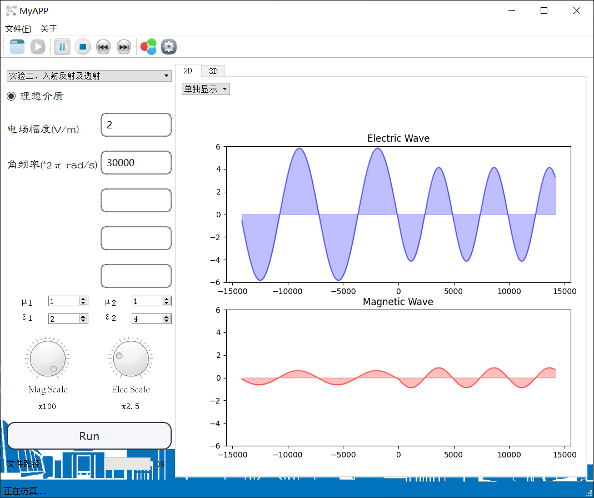

# Electromagnetic-APP
A simple App based on PyQT5 to simulate Electromagnetic wave and field,  for my course design 
The main file of this project is open.py

参考了网上一些样式进行了一定的界面美化。
可以仿真传播、入射和波导三个实验。包括2D和3D画面。可以暂停和继续，并保存仿真图片。